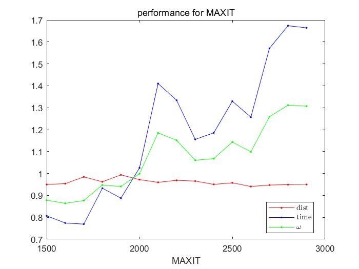
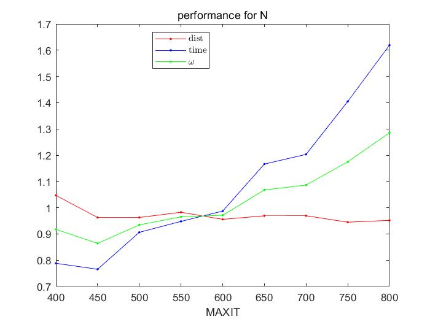
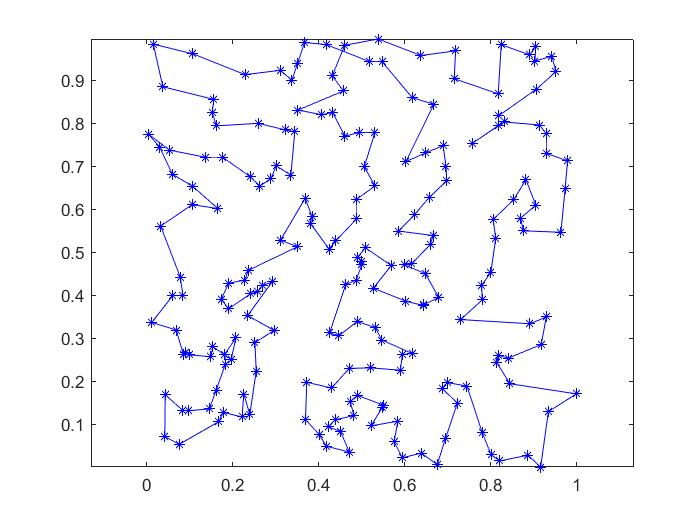

### 计算机模拟 HW4

**3180105843 汪奕晨**

#### 问题重述

在用模拟退火算法求解TSP的过程中，我们用到了以下参数
$$
T_0: 退火的初始温度\\
MAXIT: 每个温度下进行迭代的次数\\
N: 退火的总次数
$$
本文将探讨如何选取这些超参数使得代码有最好的表现


#### 如何判定两组参数的优劣

如仅考虑距离最优，显然将三个参数尽可能的大会得到更好的结果。但这会使得耗时巨大。且在实际中我们并不一定需要得到最优解，耗时也是实际考虑的重要因子。故我们需要综合考虑距离最低与时间最短，即求
$$
params = argmin(\omega) = argmin( \mu dist + (1-\mu) time), \quad 0 \le \mu \le1\\
dist 为距离，time为运行时间,\mu为手动赋予的权值
$$
由于距离与时间有不同的量纲，我们以课上给定的有较好表现的参数给出的最短距离与耗时作为标准，对其他参数下得到的距离与时间进行归一化处理（即除以标准距离与时长使得二者都在1附近）。$\mu$越大，距离所占的决策因子比例越大，我们这里不妨设$\mu = 0.5$

**注：$T_0 = 20, MAXIT=2000, N=600$得到标准参考值为dist = 11.6959, time =  269.8750**

#### 参数优化的方法

##### 单参数分析

假设各个参数表现最优的值是独立的。我们可以绘制改变一个参数时的表现曲线，选取表现最好的参数即可。

<div style = "text-align:center;">
	
    
</div>


由于初始温度是以对数下降，故如需要做搜索，应该在对数标度的离散值中搜索。而初始温度只要保证在初期环游能遍历每一种可能即可，$T_0 = 20$在先前的测试中已经有比较好的表现，这里不做优化。


##### batch test

由于固定参数时得到的结果仍然具有随机性，进行一个batch的测试后取平均值可以更好地衡量各参数的优劣。此外，对一个较为优秀的参数，多次得到的结果应该具有稳定性，故batch内测试结果的方差也可以用来衡量参数的优劣。由于


##### 网格优化

事实上，各个参数之间的表现并不是独立的。例如显然的初温度与降温次数就不是独立的参数。

所以我们给定每个超参数离散点的笛卡尔积，得到超参数网格，在该网格上进行batch测试可以搜索到一个表现最好的参数。

但由于本方法耗时过长，这里不做演示。

事实上，在机器学习中超参数的优化，网格优化也是非常重要的一个方法，在Python中我们可以在scikit-learn中通过GridSearchCV类实现网格搜索。


#### 结果展示

根据单参数优化得到的结果，我们选择$T_0 = 20, MAXIT = 1600, N = 450$

结果$dist = 11.4091, time = 215.39s$，环游顺序为



尽管它得到的结果并不一定是最好的（显然，如结果图$(0,4,0.95)$左右的路径），但在结果大致都比较好（本例中为11附近）时，该方法可以最大程度上的节约资源（即降低运行时间）。而模拟退火算法作为一个不能保证给出全局最优的算法，这样的结果是可以接受的。

#### 改进空间

+ 当我们以某个步长找到了某个参数的最优值后，可以尝试降低步长选取更精细的结果。例如测试了$MAXIT = 1500:3000:100$，选取$MAXIT = 1600$后，可以再对$MAXIT = 1500:1700:25$做搜索，得到更精细的解


<div STYLE="page-break-after: always;"></div>


### 附录

将原main封装为moduletest

```matlab
function [dist, tt, x] = moduletest(T0, a, MAXIT, N, plt)  
    load cityXY;
    t1 = clock;
    x = TSPSA(cityXY, T0, a, MAXIT, N);
    t2 = clock;
    
    tt = etime(t2,t1);
    if plt == 1
        hold off;
        plotcities(x);
        axis equal;
    end
    dist = distance(x);
end
```

生成单参数分析的main代码：

```matlab

load cityXY;

T0 = 20;
MAXIT = 2000;
N = 600;

dist0 = 11.6959;
t0 = 269.8750;
w = inf;

dists = zeros(1,9);
ts = zeros(1,9);

i = 1;
for N = 400:50:800
 [dists(i),ts(i), x] = moduletest(20, 0.95, 2000, N, 0);
 if dists(i)/dist0 * 0.5 + ts(i)/t0 * 0.5 <= w
    w = dists(i)/dist0 * 0.5 + ts(i)/t0 * 0.5;
    minx = x;
    mini = i;
 end
    i = i + 1;
end

xx = 400:50:800;
figure
plot(xx, dists/dist0, 'r.-')
hold on
plot(xx, ts/t0, 'b.-')
plot(xx, ts/t0.* 0.5 + dists/dist0 * 0.5, 'g.-')
legend('dist','time','$\omega$','interpreter','latex','location','best')
title('performance for N')
xlabel('MAXIT')
```

